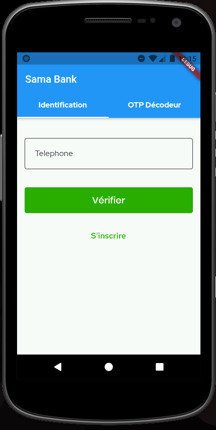

# Projet Compléments Cryptographique : Cryptographie et Sécurité des Systèmes Bancaires

Ce dépôt contient le code source du projet du module de compléments cryptographique.

## Description

Le projet est constitué des composants suivants:

- [SamaBank App : Application mobile](https://github.com/PapiHack)
- [Bank API : Backend en Spring Boot](https://github.com/PapiHack)
- [SMS Sender Service : Service d'envoi de SMS](https://github.com/PapiHack)

## Stack Technlogique

- `Dart & Flutter`
- `Java & Spring Boot`
- `Python & FastAPI`
- `PostgreSQL`

## Architecture

De manière simple, l'application mobile communique avec les services web exposés par le `Bank API`. Ce dernier est branché sur une base de données
`PostgreSQL` et interagit avec le service d'envoi de SMS au besoin afin de notifier les utilisateurs sur d'éventuels événements.

## Screenshots de l'application mobile

## Documentation API

## Auteur

- [M.B.C.M](https://github.com/PapiHack)
  

  UCAD\ESP\DGI\M2MSSI - 2021