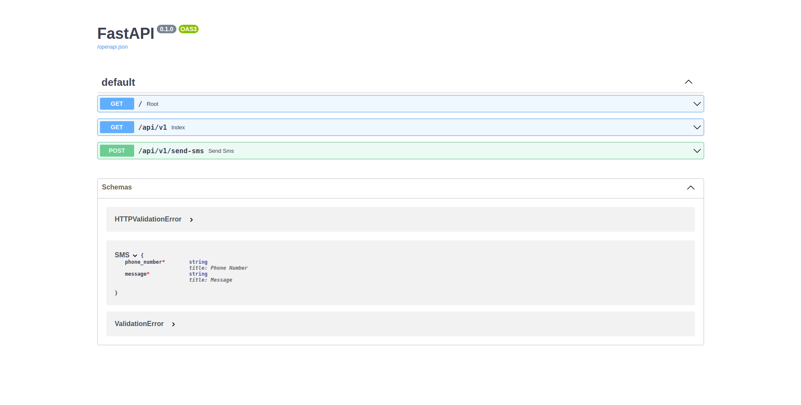

# SMS Sender API

Service d'envoi de SMS avec l'API d'orange intégrée.

## Technologies utilisées

- `Python`
- `FastAPI`

## Pré-requis

Vous avez besoin d'avoir `Python` installé et disponible sur votre système.

- [Installation de Python](https://www.python.org/downloads/)

## Usage

Après avoir cloner le projet :

- Renommer le fichier `.env.example` en `.env`, puis mettez-y les valeurs correspondantes aux variables ([ORANGE SMS API](https://developer.orange.com/apis/sms-sn))

- Placez-vous à la racine du projet, ouvrir un terminal puis faire `pip install -r requirements.txt`

- Toujours à la racine du projet, démarrez le serveur avec `uvicorn main:app`

- Puis rdv sur votre navigateur à l'adresse <http://localhost:8000/docs> ou encore <http://localhost:8000/redoc> 😊

### Screenshots

## Auteur

- [M.B.C.M](https://github.com/PapiHack)
  

